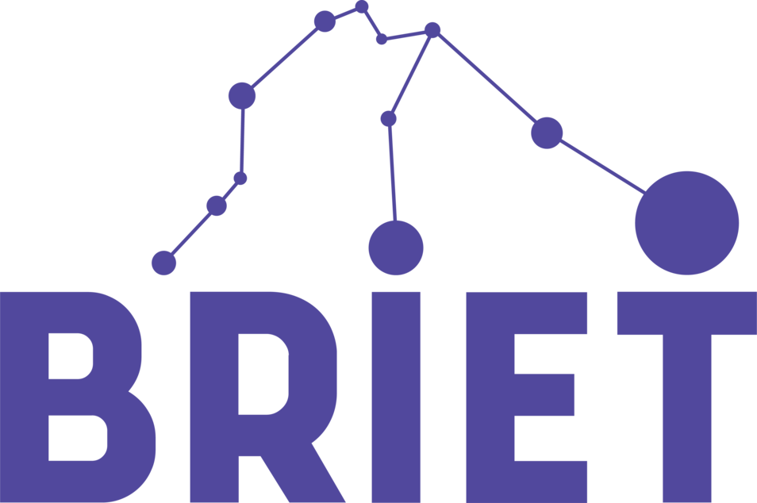

{ width="520" }
# BRIET: Biblioteconomia, Representação, Interoperabilidade, E-science e Tecnologia

O grupo investiga o conceito de dado de pesquisa e os processos que envolvem sua transformação em informação e conhecimento científico. Estuda os cenários que dão origem à geração, uso e compartilhamento intensivos de dados: eScience, Ciência Aberta, simulação, big data científico versus cauda longa da ciência e que possibilitam o seu reuso para fins de geração de novos conhecimentos, Estuda ainda tecnologias e ferramentas que possibilitam a gestão, a organização, a curadoria, a representação, a encontrabilidade, o acesso, a interoperabilidae e o reuso de dados e informações técnicos-científicas.

## Informações BRIET

### Identificação

| | |
| --- | --- |
| Situação do grupo: | Certificado |
| Ano de formação: | 2017 |
| Data da Situação: | 11/12/2017 13:59 |
| Data do último envio: | 23/05/2022 17:50 |
| Líder(es) do grupo: | Luana Farias Sales Marques e Luis Fernando Sayão |
| Área predominante: | Ciências Sociais Aplicadas; Ciência da Informação |
| Instituição do grupo: | Instituto Brasileiro de Informação em Ciência e Tecnologia - IBICT |
| Unidade: | Departamento de Ensino e Pesquisa |
| Telefone: | +552138739450 |
| Contato do grupo: | [luanasales@ibict.br](mailto:luanasales@ibict.br) |

### Linhas de pesquisa
- **Gestão e curadoria de dados de pesquisa**: estuda aspectos conceituais voltados para a gestão de dados digitais de pesquisa, bem como normas, padrões e tecnologias adequadas para a curadoria digital desses dados, incluindo sua preservação e compartilhamento.
- **Dados FAIR**: estuda a adoção de padrões para tratamento de dados, como metadados, ontologias, identificadores persistentes e demais recursos que possibilitem tornar dados de pesquisa FAIR (findable - encontráveis, acessible - acessíveis, interoperable - interoperáveis, reusable - reusáveis). Se coloca como ponto para reunião de pesquisadores que participam da iniciativa Go-FAIR-Brasil e suas redes de implementação.
- **Organização do conhecimento e recuperação da informação**: estuda os fundamentos teóricos e metodológicos da organização do conhecimento em diferentes contextos de estudo e aplicação. Estuda ainda os sistemas de organização do conhecimento (SOCs)e os processos de tratamento, representação e busca em sistemas de recuperação de informação (SRI)s tradicionais e digitais 
- **Gestão do conhecimento nuclear**: estuda soluções estratégicas para a preservação, compartilhamento e disseminação do conhecimento produzido no domínio das ciências nucleares, tendo como elemento norteador o desenvolvimento científico e tecnológico do país na área nuclear.

### Repositórios
- [CNPQ - Diretório dos grupos de pesquisa no Brasil - Lattes](http://dgp.cnpq.br/dgp/espelhogrupo/5689364231308349)
- [Github - Repositório do Grupo BRIET](https://github.com/grupo-briet)
- [Youtube - Canal do Grupo BRIET](https://www.youtube.com/channel/UCwbvIl-TSZOSritOESaukQQ)
